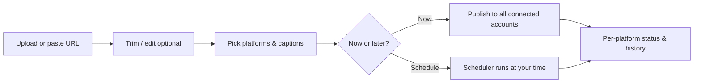

# PostPilot

> **One take, every feed.**  
> Upload your video once — PostPilot publishes it to every social channel you connect.

  <a href="https://postpilot.leitbuilt.com"><strong>→ Open PostPilot</strong></a>
  &nbsp;·&nbsp;
  <a href="https://postpilot.leitbuilt.com/register"><strong>Create free account</strong></a>
  &nbsp;·&nbsp;
  <a href="https://postpilot.leitbuilt.com/pricing">Pricing</a>
  &nbsp;·&nbsp;
  <a href="https://postpilot.leitbuilt.com/contact">Contact</a>

---

## Why PostPilot?

Creators shouldn’t re-upload the same reel six times. PostPilot is a **cross-posting studio**: connect your accounts once, upload (or paste a URL), tweak captions per platform if you want, and publish or schedule — **YouTube**, **Instagram**, **Facebook Page**, **TikTok**, **LinkedIn**, and **X** from one place.

| | |
|---|---|
| **Connect once** | OAuth — you sign in on each network; tokens stay encrypted on our side. |
| **Upload once** | One file or direct video URL; server-side encoding fits each platform. |
| **Caption your way** | Shared title/caption or custom text per destination. |
| **Publish or schedule** | Post now or pick a time; retry failed platforms from the scheduler. |
| **Optional AI (BYOK)** | Bring your own Groq or OpenAI key to draft titles from audio — you pay the API, not us. |

---

## How it works

1. **Register** at [postpilot.leitbuilt.com/register](https://postpilot.leitbuilt.com/register).
2. **Connections** — link the networks you use ([Connections](https://postpilot.leitbuilt.com/connections)).
3. **Upload** — file or URL, optional trim, optional AI captions ([Upload](https://postpilot.leitbuilt.com/upload)).
4. **Track** — history, drafts, and scheduled jobs in the [Scheduler](https://postpilot.leitbuilt.com/scheduler).

Install on your phone: PostPilot is a **PWA** — on mobile, use your browser’s **Add to Home Screen** after visiting the site over HTTPS.

---

## Platforms

| Platform | Connect | Video publish |
|----------|---------|----------------|
| YouTube | Yes | Yes |
| Instagram | Yes | Yes |
| Facebook Page | Yes | Yes |
| TikTok | Yes | Yes |
| LinkedIn | Yes | Limited by API tier |
| X (Twitter) | Yes | Limited by API tier |

Meta and TikTok apps may require provider review for production traffic; see their developer policies when you scale.

---

## Plans

| Plan | Price | Posts / month* | History & files |
|------|-------|----------------|-----------------|
| **Free** | €0 | 30 | 7 days |
| **Pro** | €9.99 / month | 200 | 90 days |

\*Each **destination that publishes successfully** counts as **one post**. One upload to four platforms = up to four posts. Failed destinations do not use your quota. Drafts don’t count until you publish.

Details and checkout: **[postpilot.leitbuilt.com/pricing](https://postpilot.leitbuilt.com/pricing)**

---

## For developers & self-hosters

This repository is the full **Next.js** application (PostgreSQL, Prisma, Docker, ffmpeg). The root **[README](../README.md)** covers:

- Local development and Docker production
- OAuth app setup (Google, Meta, TikTok, LinkedIn, X)
- Deploy to Hetzner / GHCR, Caddy, backups

If you run your own instance, set `NEXT_PUBLIC_APP_URL` to your domain and register redirect URLs with each provider.

**Other docs in this folder**

| Doc | Purpose |
|-----|---------|
| [FIRST-DEPLOY-HETZNER.md](./FIRST-DEPLOY-HETZNER.md) | First-time VPS deploy checklist |

---

## Built with

Next.js · React · PostgreSQL · Prisma · Stripe · ffmpeg · Docker

---

  Questions or feedback? <a href="https://postpilot.leitbuilt.com/contact">Get in touch</a> through the app.

